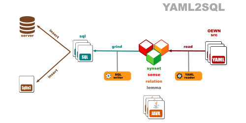

# Open English Wordnet YAML-to-SQL grinder

This library reads a model from YAML files and writes it to SQL format.

Project [grind_yaml2sql](https://github.com/x-englishwordnet/grind_yaml2sql)

See also [model](https://github.com/x-englishwordnet/model/blob/master/README.md).

See also [fromyaml](https://github.com/x-englishwordnet/fromyaml/blob/master/README.md).

See also [tosql](https://github.com/x-englishwordnet/tosql/blob/master/README.md).

See also [x-englishwordnet](https://github.com/x-englishwordnet) and [globalwordnet/english-wordnet](https://github.com/globalwordnet/english-wordnet).

## Dataflow

This library reads from the OEWN distribution YAML files and other YAML files that contain extra data.

This output conforms to the **SQL** standards.

## Command line

`grind.sh [YAML] [YAML2] [SQL]`

grinds the SQL database

*where*

[YAML] directory where OEWN distribution YAML files are

[YAML2] directory where extra YAML files are

[SQL] directory where SQL files are output

## Maven Central

		<groupId>io.github.x-englishwordnet</groupId>
		<artifactId>yaml2sql</artifactId>
		<version>1.0.0-SNAPSHOT</version>

## Dependencies

