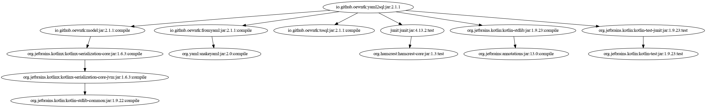

# Open English Wordnet YAML-to-SQL grinder [WORK IN PROGRESS]

This library reads a model from YAML files and writes it to SQL format.

Project [grind_yaml2sql](https://github.com/x-englishwordnet/grind_yaml2sql)

## Maven Central

		<groupId>io.github.x-englishwordnet</groupId>
		<artifactId>yaml2sql</artifactId>
		<version>1.0.0-SNAPSHOT</version>

## Dependencies

